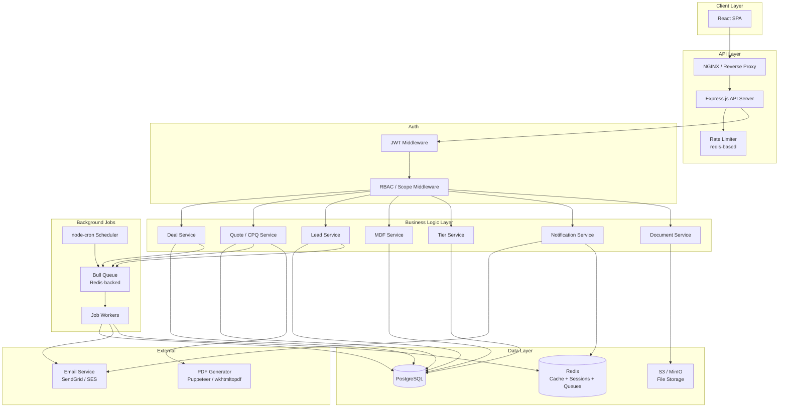
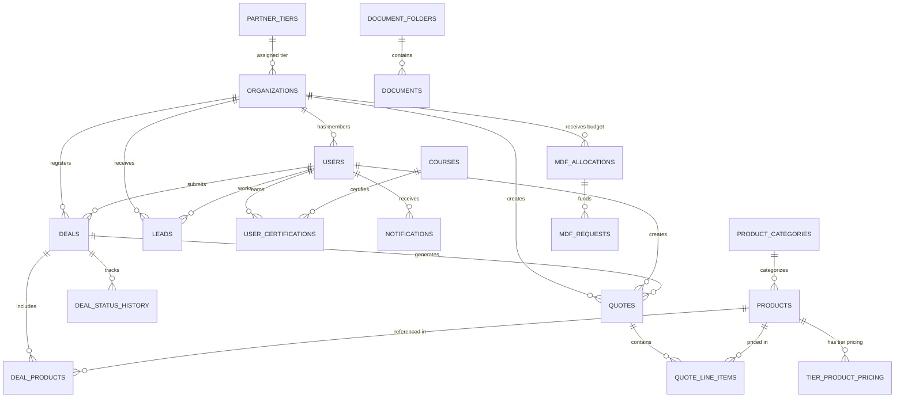
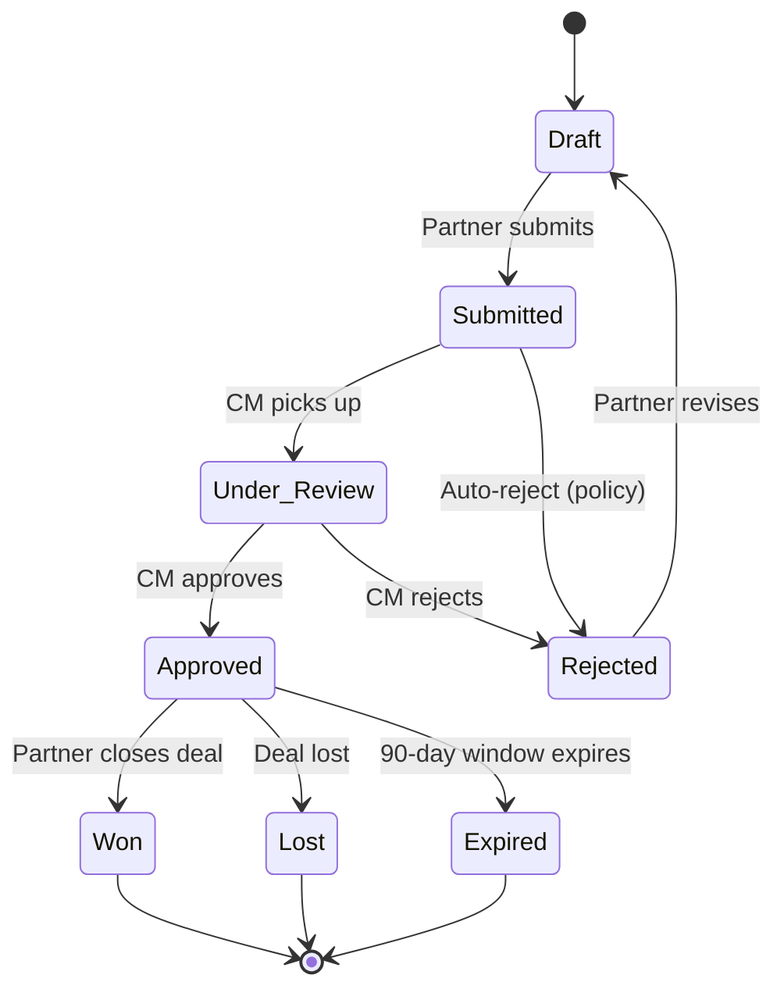
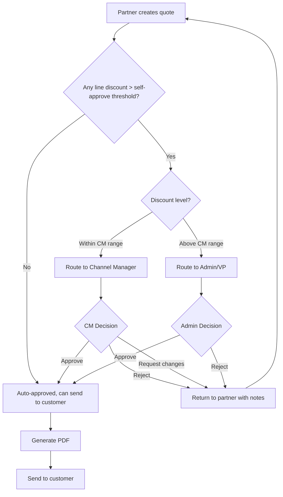
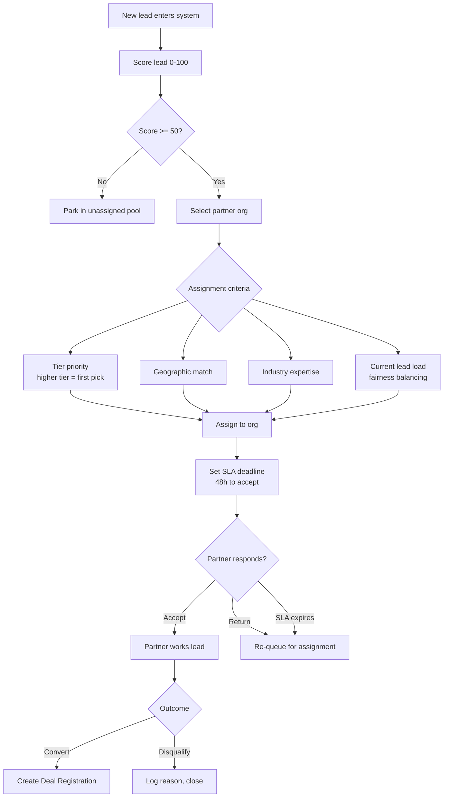

# PRM Portal — Architecture Diagrams

## System Architecture



## Entity Relationship Overview



## Deal Registration State Machine



## Quote Approval Flow



## Lead Distribution Flow



## Project Structure

```
prm-portal/
├── src/
│   ├── config/
│   │   ├── database.js          # Knex/pg pool config
│   │   ├── redis.js             # Redis client
│   │   ├── auth.js              # JWT secrets, expiry
│   │   └── constants.js         # Enums, limits, defaults
│   ├── middleware/
│   │   ├── authenticate.js      # JWT verification
│   │   ├── authorize.js         # Role-based guard
│   │   ├── scopeToOrg.js        # Partner data scoping
│   │   ├── rateLimiter.js       # Redis-backed rate limiting
│   │   ├── validate.js          # Joi/Zod schema validation
│   │   ├── errorHandler.js      # Global error handler
│   │   └── activityLogger.js    # Auto-log to activity_feed
│   ├── routes/
│   │   ├── auth.routes.js
│   │   ├── users.routes.js
│   │   ├── organizations.routes.js
│   │   ├── tiers.routes.js
│   │   ├── deals.routes.js
│   │   ├── products.routes.js
│   │   ├── quotes.routes.js
│   │   ├── leads.routes.js
│   │   ├── mdf.routes.js
│   │   ├── courses.routes.js
│   │   ├── documents.routes.js
│   │   ├── notifications.routes.js
│   │   └── dashboard.routes.js
│   ├── controllers/             # Thin controllers (parse request, call service, send response)
│   │   └── [mirrors routes]
│   ├── services/                # Business logic layer
│   │   ├── auth.service.js
│   │   ├── deal.service.js      # includes conflict detection
│   │   ├── quote.service.js     # includes discount evaluation
│   │   ├── lead.service.js      # includes assignment logic
│   │   ├── mdf.service.js       # includes allocation rules
│   │   ├── tier.service.js      # includes auto-calculation
│   │   ├── notification.service.js
│   │   └── activity.service.js
│   ├── repositories/            # Data access layer (SQL queries)
│   │   └── [mirrors services]
│   ├── jobs/                    # Background job processors
│   │   ├── queue.js             # Bull queue setup
│   │   ├── tierRecalculation.job.js
│   │   ├── dealExpiration.job.js
│   │   ├── leadSlaCheck.job.js
│   │   ├── certExpiryWarning.job.js
│   │   ├── mdfDeadlineCheck.job.js
│   │   └── metricsRollup.job.js
│   ├── utils/
│   │   ├── AppError.js          # Custom error class
│   │   ├── pagination.js        # Cursor/offset pagination helpers
│   │   ├── filters.js           # Query param -> SQL WHERE builder
│   │   └── numberGenerator.js   # Deal/quote/lead number generation
│   ├── validators/              # Joi/Zod schemas per entity
│   │   └── [per entity]
│   └── app.js                   # Express app setup
├── migrations/                  # Knex migration files
├── seeds/                       # Seed data (tiers, sample products)
├── tests/
│   ├── unit/
│   ├── integration/
│   └── fixtures/
├── docs/                        # This documentation
├── .env.example
├── knexfile.js
└── package.json
```
